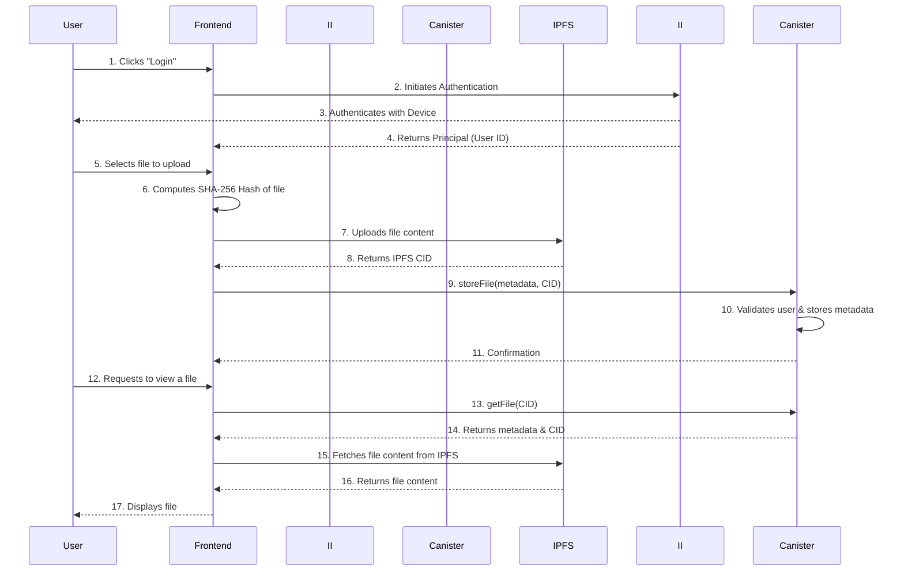

# DeVault: Architecture & System Design

This document outlines the architecture, user flow, and technical details of DeVault, a decentralized document storage and verification platform built on the Internet Computer Protocol (ICP).

## 1. Introduction

DeVault provides a secure, decentralized, and tamper-proof solution for storing, managing, and verifying critical documents. By leveraging the unique capabilities of ICP, DeVault ensures data integrity, availability, and user control, addressing the shortcomings of traditional centralized storage systems.

- **Utility & Value**: In a world where data breaches and censorship are rampant, DeVault offers a resilient and uncensorable alternative. It empowers users to own and control their data, providing cryptographic proof of existence and ownership for any digital asset. This is invaluable for legal documents, intellectual property, academic credentials, and any file where authenticity and provenance are paramount.

- **Technical Vision**: The project combines a robust Motoko backend running on ICP with a modern React frontend, utilizing decentralized authentication (Internet Identity) and distributed storage (IPFS/Web3.Storage) to create a fully decentralized application.

## 2. System Architecture

DeVault's architecture is designed around a set of interconnected canisters and services that together provide a seamless and secure user experience.

### High-Level Diagram

```mermaid
graph TD
    subgraph User Interface
        A[React Frontend]
    end

    subgraph ICP Backend
        B[DeVault Canister (Motoko)]
        C[Internet Identity]
    end

    subgraph Decentralized Storage
        D[IPFS / Web3.Storage]
    end

    A -- Authenticates via --> C
    A -- Stores & Manages Files --> B
    B -- Stores File Metadata --> B
    B -- Off-chain Storage --> D
```

**Subtext:** The user interacts with the React frontend, authenticating via Internet Identity. The frontend communicates with the DeVault canister, which manages file metadata and business logic. Large files are stored off-chain on IPFS via Web3.Storage to optimize canister memory usage.

---

### Core Components

#### 1. **React Frontend**
- **Description**: A modern, responsive single-page application (SPA) built with React and styled with TailwindCSS. It serves as the primary user interface for interacting with DeVault.
- **Key Files**: `frontend/src/main.jsx`, `frontend/src/index.html`
- **Responsibilities**:
    - User authentication flow via Internet Identity.
    - File upload, download, and verification interfaces.
    - Displaying user's file list and storage statistics.
    - Client-side hashing of files for integrity checks.

#### 2. **Internet Identity**
- **Description**: A decentralized authentication system for the Internet Computer. It allows users to create a secure, device-based identity without relying on traditional usernames and passwords.
- **Integration**: The frontend uses the `@dfinity/auth-client` library to integrate with Internet Identity, providing a seamless and secure login experience.

#### 3. **DeVault Canister (Motoko)**
- **Description**: The heart of the application, this Motoko actor class contains the core business logic for file management, user profiles, and access control.
- **Key Files**: `backend/src/devault_backend/main.mo`, `backend/src/devault_backend/types.mo`
- **Responsibilities**:
    - **Metadata Storage**: Stores `FileInfo` records (name, size, hash, owner, timestamp) in a stable `TrieMap`.
    - **User Management**: Manages user profiles and storage quotas.
    - **Access Control**: Enforces rules, ensuring only file owners can access or delete their files.
    - **Verification Logic**: Provides a public query method to verify a file's existence and metadata using its hash.
    - **IPFS Integration**: (Future) Will interact with an IPFS service or use HTTP outcalls to pin files to Web3.Storage.

#### 4. **IPFS / Web3.Storage**
- **Description**: A decentralized storage network for content-addressable data. Web3.Storage provides a simple API for storing data on IPFS and Filecoin.
- **Integration**: To keep canister storage costs low and handle large files efficiently, DeVault will store the actual file content on IPFS. The Motoko canister will only store the IPFS Content Identifier (CID) along with other metadata.

### Detailed Canister Interaction


**Subtext:** This diagram illustrates the end-to-end flow of a user uploading and then viewing a file, showcasing the interaction between the frontend, canister, and IPFS.

---

## 3. User Flow & Walkthrough

A typical user journey through the DeVault application.

1.  **Landing & Authentication**:
    - A new user lands on the homepage and is prompted to log in.
    - They click "Login" and are redirected to the Internet Identity service.
    - After authenticating with their registered device (e.g., via biometrics), they are redirected back to the DeVault dashboard, now logged in with their unique `Principal`.

2.  **File Upload**:
    - In the dashboard, the user navigates to the "Upload" tab.
    - They select a file from their local machine.
    - The frontend calculates the file's SHA-256 hash in the browser.
    - The file is then uploaded to IPFS via a client-side library interacting with Web3.Storage.
    - Once the IPFS CID is obtained, the frontend calls the `storeFile` method on the DeVault canister, passing the file's metadata (name, type, size, hash) and the IPFS CID.
    - The canister validates the request, creates a `FileInfo` record, and stores it, linking it to the user's `Principal`.

3.  **File Verification**:
    - Any user (even if not logged in) can verify a document's authenticity.
    - They navigate to the "Verify" tab and enter a document's hash.
    - The frontend calls the `verifyFile` query method on the canister.
    - If the hash exists, the canister returns the associated `FileInfo` (owner, creation date, etc.), confirming its registration on the blockchain.

4.  **Managing Files**:
    - A logged-in user can view all their uploaded files in the "My Documents" tab.
    - The frontend calls the `getUserFiles` method, and the canister returns a list of all `FileInfo` records owned by that user's `Principal`.
    - The user can then choose to view (download from IPFS) or delete a file. Deleting a file removes the metadata from the canister and (optionally) unpins it from IPFS.

---

## 4. Code & Project Structure

- **Code Quality**: The backend code in `main.mo` is structured with clear, single-purpose functions. It uses stable data structures for state persistence across upgrades and separates type definitions into `types.mo` for clarity. The code is commented, follows Motoko conventions, and includes error handling for robust operation.

- **Key Directories & Files**:
    - `backend/src/devault_backend/main.mo`: The core application logic. All interactions with the DeVault service are handled here.
    - `backend/src/devault_backend/types.mo`: Defines the data structures used throughout the canister, promoting type safety and maintainability.
    - `frontend/src/main.jsx`: The main entry point for the React application.
    - `dfx.json`: The configuration file for the DFINITY Canister SDK, defining the canisters in the project and their settings.
    - `README.md`: Contains the project overview, setup instructions, and core concepts.

---

## 5. Technical Implementation & ICP Features

- **Canister State Management**: The application uses stable `TrieMap`s for storing file and user data. This is a best practice on ICP, ensuring that all data persists automatically during canister upgrades.
- **Authentication**: Leverages **Internet Identity** for password-less, secure authentication, which is a key feature of the ICP ecosystem.
- **Public Verification**: The `verifyFile` function is a `query` call, making it a fast, read-only operation that doesn't require consensus. This allows for efficient and free public verification of documents.
- **Future Advanced Features**:
    - **HTTP Outcalls**: To securely interact with Web3.Storage from the canister to pin/unpin files without relying on the client.
    - **Canister Timers**: To run periodic jobs, such as auditing storage usage or cleaning up expired files.
    - **t-ECDSA**: To sign transactions on other blockchains, enabling cross-chain verification of document proofs.

By building on this solid foundation, DeVault is well-positioned to deliver a powerful and truly decentralized storage solution.
