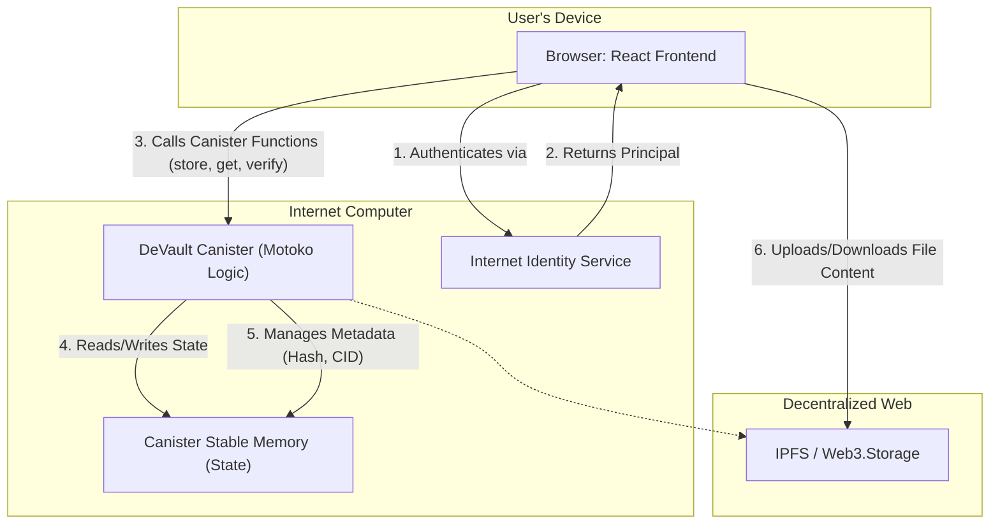
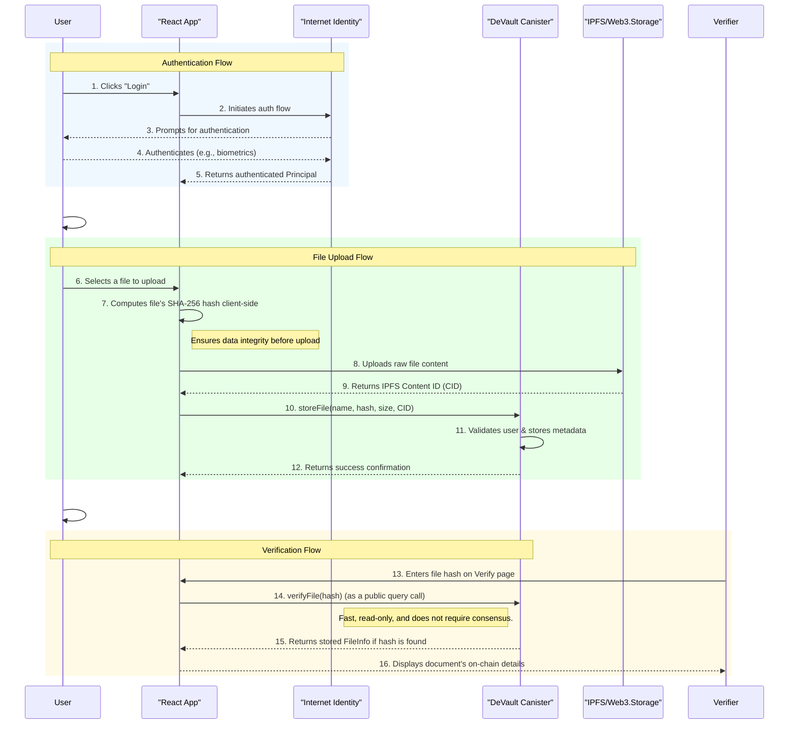

# DeVault - Visualized Flows (Excalidraw)

This document provides a visual representation of DeVault's infrastructure and user flows using Mermaid diagrams, corrected for syntax and improved for readability.

## 1. Infrastructure & Implementation Diagram

This diagram illustrates the technical components of the DeVault application and how they interact.

**Subtext:** The user interacts with the React frontend in their browser. Authentication is handled by Internet Identity. The frontend calls the main DeVault canister for business logic, which persists metadata in stable memory. The actual file content is stored on IPFS to ensure the canister remains lightweight and cost-effective.

---

## 2. User Flow: File Upload & Verification

This sequence diagram details the step-by-step process a user follows to upload a new file and how it can be verified. It has been expanded for clarity.

**Subtext:** The flow begins with secure authentication. For uploads, the file is first hashed and stored on IPFS by the client, and only the resulting metadata (hash and CID) is sent to the canister. This makes the process efficient. Verification is a simple, fast, and public query using the file's hash.